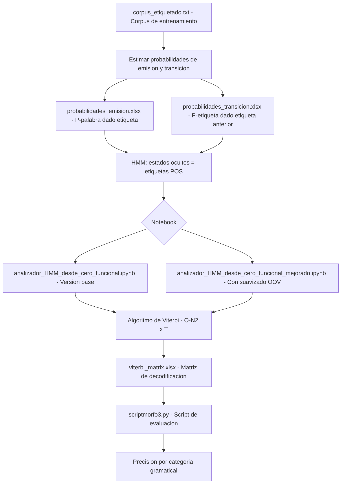

# Etiquetador Morfosintáctico (POS Tagger) con HMM

> POS tagger con Modelo Oculto de Markov implementado desde cero: entrenamiento supervisado y decodificación Viterbi.

## Descripción

---

Implementación completa de un etiquetador morfosintáctico (Part-of-Speech Tagger) basado en **Modelos Ocultos de Markov (HMM)** construido desde cero en Python/Jupyter. Incluye estimación de probabilidades de emisión y transición sobre corpus etiquetado, decodificación con el algoritmo de **Viterbi** y evaluación de precisión por categoría gramatical.

## Contenido del repositorio

| Archivo | Descripción |
|---|---|
| `analizador_HMM_desde_cero_funcional.ipynb` | Implementación base del HMM POS tagger |
| `analizador_HMM_desde_cero_funcional_mejorado.ipynb` | Versión optimizada con suavizado y manejo de OOV |
| `corpus_etiquetado.txt` | Corpus de entrenamiento y evaluación |
| `*.pdf` | Informe de resultados y análisis |

## Arquitectura

## Contexto académico

**Asignatura:** Minería de Información y Análisis — NLP · **Institución:** Ingeniería Informática
**Autor:** Alejandro De Mendoza — Ingeniero Informático · Especialista en IA

---

## Autor

**Alejandro De Mendoza**  
Ingeniero Informático · Especialista en IA · Especialista en Ingeniería de Software · Máster en Arquitectura de Software

